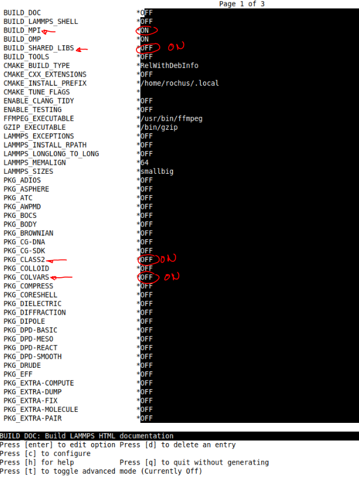

# What are cmc-tools?

Version 2025.02.0 aka Edsger Dijkstra

This is a tool collection for **C**omputational **M**aterials **C**hemistry and collects the various efforts of the CMC group at the Ruhr-University Bochum to perform mainly force field calculations using MOF-FF for MOFs and other systems.

The following sections will outline how to setup our tools on a recent linux desktop machine. If you want to use these tools in an HPC environment you may need to deviate from these instructions, to accommodate for your custom HPC setup.

This repository contains four interwoven modules:
* molsys: another pure python library to handle molecular systems, base class for pylmps as well as other codes
* pylmps: our python lammps wrapper, inspired by the older pydlpoly code
* mofplus: a little addon to connect to the MOF+ website http://www.mpofplus.org, needed for paramter assignement and other tasks
* weaver: a package for constructing MOFs according to the reverse topological approach, given as et of building blocks and a topology

Additionally we maintane a custom fork of LAMMPS, which is needed in conjunction with pylmps and can be found [here](https://github.com/MOFplus/lammps)!

# Installation
This installation guide has been tested on a fresh install of Ubuntu 24.04 LTS.

## Preliminary - System packages
There are a few system packages that are requiered to utilize or python modules as well as our LAMMPS fork. In an HPC environment these are likely already available e.g. as modules. However, they may need to be installed explicitly for a desktop machine.
First you need `git` to clone this repository:
```bash
sudo apt install git
```
Our python code makes use of the `mpi4py` library and we therefore need to install `openmpi`:
```bash
sudo apt install libopenmpi-dev
```
For LAMMPS to work we need the usual `build-essentials`, `cmake`, `FFTW` and `HDF5`:
```bash
sudo apt install build-essential cmake-curses-gui libhdf5-serial-dev libfftw3-dev libfftw3-doc
```

## Preliminary - Micromamba
We use [Micromamba](https://mamba.readthedocs.io/en/latest/installation/micromamba-installation.html) to handle the python environment. However, alternatives like `miniconda` and `pixi` should also work fine. The deciding factor is probably gone be if your environment manager is able to install `graph_tool`.
To install Micromamba you can simply run:
```bash
"${SHELL}" <(curl -L micro.mamba.pm/install.sh)
```
and than follow the instructions on screen. For a more detailed guide please refer to the [official documentation](https://mamba.readthedocs.io/en/latest/installation/micromamba-installation.html).

## Creating the `molsys` environment
The first step to create the environment is saving the following content in a `molsys.yml` file:
```
name: molsys
channels:
  - conda-forge
dependencies:
  - python=3.12
  - numpy
  - scipy
  - openbabel
  - graph-tool
  - xtb-python
  - packmol
  - pip
  - pip:
     - h5py
     - pydal
     - cma
     - spglib
     - pymatgen
     - ase
     - pycifrw
     - pytest
     - mpi4py
```
The code should work with python 3.8 up to 3.12. At the time of writing no `openbabel` version for python 3.13 was realesed yet. This guides assumes you go with python 3.12.
Afterwards, you can create the environment by running
```bash
micromamba create -f molsys.yml
```
and activate it with
```bash
micromamba activate molsys
```

## Cloning and setup of cmc-tools & LAMMPS
In the CMC group it is common policy to install codes into `/home/$USER/sandbox` but generally you can clone it where ever you want.
```bash
export CMC_INSTALL_DIR=/home/$USER/sandbox
echo "export CMC_INSTALL_DIR=${CMC_INSTALL_DIR}" >> /home/$USER/.bashrc
```
```bash
mkdir $CMC_INSTALL_DIR
cd $CMC_INSTALL_DIR
```
```bash
git clone https://github.com/MOFplus/cmc-tools
```
```bash
git clone https://github.com/MOFplus/lammps.git
```
Now we need to make the python modules available in your PYTHONPATH and the scripts in your PATH. For this purpose, please add the following lines to your `/home/$USER/.bashrc`:
```bash
export CMCTOOLS=$CMC_INSTALL_DIR/cmc-tools
export REAXFF_FILES=$CMCTOOLS/lammps/potentials

export PYTHONPATH=$CMCTOOLS/src:$PYTHONPATH
export PYTHONPATH=$CMC_INSTALL_DIR/lammps/python:PYTHONPATH

export PATH=$CMCTOOLS/scripts/molsys:$PATH
export PATH=$CMCTOOLS/scripts/pylmps:$PATH
export PATH=$CMCTOOLS/scripts/mofplus:$PATH
```
Afterwards, you should source your `.bashrc` via:
```bash
source /home/$USER/.bashrc
```
## Building LAMMPS
Building lammps is probably the most difficult step. There are advanced strategies to build lammps for differemt hardware platforms. Please find the details about building lammps here:
https://docs.lammps.org/Build.html

The description here is the "standard way" to get lammps running on a linux machine in context of the cmc-tools. One needs to generate the MPI parallel shared library, which is used together with the Python wrappers.

Meanwhile we recommend to use the strategy built on **cmake** (actually we are not sure if the classic **Makefile** based version still works). In order to work with **pylmps** (the cmc-tools python wrapper for lammps) you need to build our local cmc version of lammps, which contains some changes and bad hacks, which are not part of the official lammps distribution.

First ensure that you are on the correct branch, **new_Sept2024** is the most recent one at the time of writing, in the lammps submodule:
```bash
cd $CMC_INSTALL_DIR/lammps
```
```bash
git fetch
git checkout new_Sept2024
```
Then generate a `build_2024` directory:
```bash
mkdir build_2024
cd build_2024
```
At this point you should ensure that your **molsys** environment is loaded, if not run:
```
micromamba activate molsys
```
Now you can start the build process by using cmake. We prefer to use the nice ccmake with a simple curses based gui on the terminal (we already installed it above).
The process works as follows: you have to iteratively *configure*, sometimes adjust some choices, until you can fianlly generate the make file. Then make will build everything.

### Building
During the build process LAMMPS will requiere some files from your `numpy` installation (in your environment), however these are not always found automatically. To fix this you can set the following environment variable:
```bash
export CPLUS_INCLUDE_PATH=/home/$USER/micromamba/envs/molsys/lib/python3.12/site-packages/numpy/_core/include
```
This assumes you used python 3.12, if you picked a different version you need to adjust the path above!
Now we can start with 
```bash
ccmake ../cmake
```
All you see is an "EPMPTY CACHE" (depending on the version you are running you might see some deprecation warning, these can be dismissed) and some options on the bottom of your screen. With *Enter* you can change settings (use cursor keys to move up and down). You need first to press **c** to start the first configure run. 
After the first configure you see all the options .. those with a **\*** can/need to be set. Many options are just **OFF** or **ON** and can be toggled with pressing **Enter**. What you see should roughly look like this:

Now you need to toggle the following options **ON**:
* BUILD_MPI
* BUILD_SHARED_LIBS
* CLASS2
* COLVARS 
* KSPACE
* MANYBODY
* MC 
* MISC
* MOFFF
* MOLECULE
* PYLMPS (needed! package not in official lammps)
* PYTHON
* QEQ 
* REAXFF 
* REPLICA

After choosing all packages to be included press again **c** to run another round of configure. Depending on your choices some further options with a **\*** will appear. In the default scenario above these are due to the choice of COLVARS and PYLMPS. For COLVARS all default options are fine, but you are welcome to change e.g. the FFT lib to be used. Please check out the COLVARS build docu on the lammps webpages to see what can be done. The other part are the locations of the hdf5 header files and libraries. In the PYLMPS package there is a new dump style called dump_mfp5 which generates HDF5 based trajectory files. Note that this works **only** with pylmps, since part of the work is done by pylmps on python level and only the actual writing of frames to the file is done in lammps within the dump_mfp5 code. Please check if these pathes are correct. Usually cmake is very clever to find the right location. It depends mainly on how you installed h5py.

If you like your settings just **c** one more time.

Now all options should be free of **\*** and a further option to generate and exit appears at the bottom. Now press **g** to do so.

Now the ccmake gui disappears.
Now you can start the actual build process with a simple
```bash
make
```
you can also speed this up by using multiple processes:
```bash
make -j4
```
This will now take a while ... and hopefully work. It should have built a *liblammps.so* (which is actually a softlink to liblammps.so.0). In order to access this shared obejct you need to softlink it from the */python* directory like this:
```bash
cd ../python/lammps
ln -s ../../build/liblammps.so .
```
You should be good to go now!
## Test if everything worked
Generate some working directory and copy some test files into it.
```bash
mkdir pylmps_test
cd pylmps_test
cp $CMCTOOLS/pylmps/tests/generic/hkust1.* .
cp $CMCTOOLS/pylmps/tests/generic/test_opt_hkust1.py .
python test_opt_hkust1.py
```
This will copy an mfpx (MOF+ coordiante file) together with the pair of ric/par (containing redundant internal coordiantes and force field paramters) to your test dir.
The script test_opt_hkust1.py performs an optimization of the HKUST1 structure and checks if you get the right energies.

The python code to load and minimize the structure looks like this (just to illustrate it):

```
pl = pylmps.pylmps("hkust1")
m = molsys.mol.from_file("hkust1.mfpx")
m.addon("ff")
m.ff.read("hkust1")
pl.setup(mol=m, local=True)
pl.MIN(0.1)
```

## Use VMD for visualizing structures
We recommend to install the current VMD code from here:

https://www.ks.uiuc.edu/Development/Download/download.cgi?PackageName=VMD

See README for installation instructions (it is basically just ```./configure; make install```).

In $CMCTOOLS/molsys/VMD-plugins you find a README and two subdirs mfpx and mfp5. mfpx are MOF+ coordiante files (text files for single structures) and mfp5 are binary hdf5 files generated by pylmps with trajectory data. You basically need a ```make install``` in both subdirs to build and copy the shared objects to the VMD plugin/molfiles directory.

To test if it works you could try to look at the hkust1.mfpx like this
```
vmd -mfpx hkust1.mfpx
```

# Quickstart
Here are some examples on how the cmc-tools are used.
## Assigning a force field

## molsys
The molsys package acts as a storage container for molecular data and provides plenty of methods to manipulate them. Generally molsys is build upon the `mol` object which can be extended using the add-on system.
Here a molsys object is initalized using our inhouse file formats: 
- ".mfpx" -> xyz, atom type and connectivity
- ".par"  -> parameters for MOF-FF calculations
- ".ric"  -> auxiliary file for .par, saving information on atom groups on which parameters are acting by atom id
```python
import molsys

m = molsys.mol.from_file("molecule.mfpx")
m.addon("ff")
m.ff.read("molecule") # <- loads molecule.par and molecule.ric

# Here some examples on the data saved in the mol object
print(f"Here the xyz data is stored:\n{m.xyz}")
print(f"Here are the elements:\n{m.elems}")
print(f"The connectivity is saved here:\n{m.conn}")

print(f"Data specific to an addon can be accessed like this: {m.ff.par}")
```
## pylmps
pylmps is our interface to conveniently start atomistic simulations using the LAMMPS software package as backend.
### Single Point Calculation
```python
import molsys
import pylmps

m = molsys.mol.from_file("molecule.mfpx")
m.addon("ff")
m.ff.read("molecule")

pl = pylmps.pylmps("molecule_SPC")
pl.setup(mol=m, kspace=True) 
#kspace = True setups the calculation to use Ewald-Summation
#instead of a cutoff based approach
e, f = pl.calc_energy_force()
print(e,f)
```
### Geometry Optimisation
```python
import molsys
import pylmps

m = molsys.mol.from_file("molecule.mfpx")
m.addon("ff")
m.ff.read("molecule")

pl = pylmps.pylmps("molecule_geoopt")
pl.setup(mol=m, kspace=True) 
pl.MIN_cg(thresh=1e-5)
pl.write("opt_molecule.mfpx")
pl.write("opt_molecule.xyz")
```
### Molecular Dynamics
```python
import molsys
import pylmps

m = molsys.mol.from_file("molecule.mfpx")
m.addon("ff")
m.ff.read("molecule")

pl = pylmps.pylmps("molecule_MD")
pl.setup(mol=m, kspace=True)
# Heat up stage
pl.MD_init(stage="heat_up", T=300, startup=True, ensemble="nvt", thermo="ber", timestep=1) #timestep in fs
pl.MD_run(nsteps=10000, printout=1000)
# Equilibration stage with Nose Hoover
pl.MD_init(stage="equil", T=300, ensemble="nvt", thermo="hoover", timestep=1)
pl.MD_run(nsteps=10000, printout=100)
# Production stage NVT
pl.MD_init(stage="MD_NVT", T=300, ensemble="nvt", thermo="hoover", timestep=1, traj=["xyz", "forces"], tnstep=10)
pl.MD_run(nsteps=100000, printout=100)
# Production state NVE
pl.MD_init(stage="MD_NVE", T=300, ensemble="nve", timestep=1, traj=["xyz", "forces", "vel"], tnstep=10)
pl.MD_run(nsteps=10000000, printout=100)
```
This code will run an MD simulation. Our MD data is writen out into an HDF5 file called ".mfp5" to allow for more performant file IO and higher disk efficiency.
We can define stages that will be saved seperately in the ".mfp5" file but can still be appended to onother to form one continuous simulation.
You have to define the properties written out during the MD using the `traj` parameter. It takes a list as argument that can contain any combination of "xyz" (write out coords), "forces" (write out forces) and "vel" (write out velocities, needed if you want to restart).