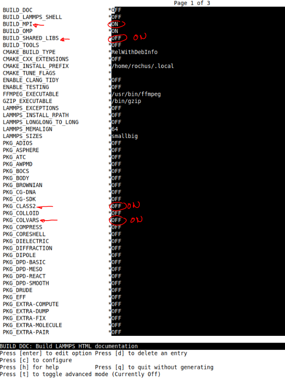

# cmc-tools

Version 2022.07.0 aka Grace Hopper 

This is a tool collection for **C**omputational **M**aterials **C**hemistry and collects the various efforts of the CMC group at the Ruhr-University Bochum to perform
mainly force field calculations using MOF-FF for MOFs and other systems.
You can either use this repo with its submodules or get the four repos directly from github.com.

This README intends to explain one (hopefully the easiest) way to install the whole suite of codes in order to run calculations on a recent linux desktop machine.
If you intend to use these codes please follow this guideline. If you want to install on say a HPC cluster with specific compiler/MPI setups you might have to 
diverge from this manual. It is just meant as a starting point.

Currently included components
-------------

* molsys (another pure python library to handle molecular systems, base class for pylmps as well as other codes)
* pylmps (our python lammps wrapper, inspired by the older pydlpoly code)
* mofplus (a little addon to connect to the MOF+ website http://www.mpofplus.org, needed for paramter assignement and other tasks)
* lammps (a slightly adpated local version of lammps .. needed to run with pylmps)

How to use get the code?
-------------

In the CMC group it is common policy to install codes into /home/*username*/sandbox

Clone the git repo

````bash
git clone https://github.com/MOFplus/cmc-tools
````

Init and update the submodules
````bash
git submodule update --init
````

In this case the codes are found in

/home/*username*/sandbox/cmc-tools/lammps etc.

### Alternative:

Clone the following repos from https://github.com/MOFplus/<repo>

* lammps
* molsys_rel
* pylmps_rel
* mofplus_rel

The _rel repos are the public release versions of our internal private repos which are updated whenever features seem to be stable enough.

In this case the codes are in 

/home/*username*/sandbox/lammps etc.


Prerequisites
-------------

### Conda environment

pylmps and molsys/mofplus are basically pure Python (3!), but for lammps one needs of course a C++ compiler plus MPI etc.
In addition, we use some libraries like graphtools  or openbabel, which are difficult to install/compile and for that reason it turned out to be very advantageous to rely on a conda environment, where all these external libraries can be retrieved via conda-forge or pip.
So you need to have gcc compiler, an MPI-library on your machine. On top of that follow the following route to
set up a conda (=miniconda) environment as a basis.

Download the latest stable Miniconda from here: https://docs.conda.io/en/latest/miniconda.html
(e.g. https://repo.anaconda.com/miniconda/Miniconda3-latest-Linux-x86_64.sh)

Run it with
``` 
bash Miniconda3-latest-Linux-x86_64.sh
```

You have to accept the license. It is common policy in the CMC group to change the name fro the conda environment from the default
/home/*username*/miniconda3 to the shorter /home/*username*/conda
Please keep this in mind, not to get confused later in this decription, when we use this default path for conda.

If your conda is set up you can generate a specific conda environment for running all the cmc-tools. The easiest way is to use a yml-file to set up the environment. This is an example yml-file used in our group. Feel free to change the settings. If you know you do not want to run xTB calculations within pylmps/lammps you can for example remove or comment out the line with xTB. Also openbabel is a molsys addon which can be handy but is not really needed. We recommend to keep graphtools because it is needed for assigning the MOF-FF paramters (the substructure search features of graphs in graphtools are extensively exploited here). The idea of this file is to rely on the compilers and MPI-libs from your distribution and to build things like mpi4py and h5py (needed for all codes) via pip. Depending on your particular setup it might be that there is a better and different way to set up the conda environment, but for a vanilla linux desktop machine this has proven to work for us.

**molsys.yml :**
```
name: molsys
channels:
  - defaults
  - conda-forge
dependencies:
  - python=3.8
  - numpy
  - scipy
  - graph-tool
  - openbabel
  - xtb-python
  - packmol
  - pip
  - pip:
     - mpi4py
     - h5py     
     - pydal
     - cma
     - spglib
     - pymatgen
     - ase
     - pycifrw
     - pytest
```
**Some notes:**
* We currently use python 3.8 .. 3.9 is untested, let us know if it works for you
* Only numpy is really needed ... scipy is rarely used, here just for convenience
* packmol only if you need to pack systems (e.g. MOFs) with guest molecules
* pydal is a Database abstraction layer from web2py ... used in findR (not really needed but does not hurt to include it)
* cma is a evolutionary global optimizer used e.g. in paramter fitting
* Keep spglib and pymatgen as well as ASE .. just good to have them around
* pycifrw is a pure python dif reader .. seems like the cif reader in pymatgen is better but we use it in the IO class in molsys so better keep it
* pytest ... well .. test test test

Just copy (and possibly adapt) the above molsys.yml file. To generate the conda environment

```
conda env create --file molsys.yml
```

This will download all the packages (or install with pip) in a local environment of your user in /home/*username*/conda/envs/molsys

In order to work with cmc-tools you always have to activate the conda environment like this:

```
conda activate molsys
```

[Here](https://conda.io/projects/conda/en/latest/_downloads/843d9e0198f2a193a3484886fa28163c/conda-cheatsheet.pdf
) you can get a nice "cheat sheet" for using conda.

After activation you see a *(molsys)* in front of your prompt. Please check if you get a Anaconda Python 3.8 if you just start python.

```
(molsys) $ python
 
Python 3.8.10 (default, Jun  4 2021, 15:09:15) 
[GCC 7.5.0] :: Anaconda, Inc. on linux
Type "help", "copyright", "credits" or "license" for more information.
>>> 
```
Now you should be set for building lammps.

Building lammps
--------------

Building lammps is probably the most difficult step. There are advanced strategies to build lammps for differemt hardware platforms. Please find the details about building lammps here:
https://docs.lammps.org/Build.html

The description here is the "standard way" to get lammps running on a linux machine in context of the cmc-tools. One needs to generate the MPI parallel shared library, which is used together with the Python wrappers.

Meanwhile we recommend to use the strategy built on **cmake** (actually we are not sure if the classic **Makefile** based version still works). In order to work with **pylmps** (the cmc-tools python wrapper for lammps) you need to build our local cmc version of lammps, which contains some changes and bad hacks, which are not part of the official lammps distribution.

If you cloned the cmc-tools repo with the submodules, you should autmatically have the right branch. In case you cloned all repos individually, please check out the most recent **new_Sept2021** branch. To do so, issue the following commands after cloning within the lammps directory (/home/*username*/sandbox/lammps):

```
git fetch
git checkout new_Sept2021
```
Then generate a /build directory.
```
mkdir build
cd build
```
Now you can start the build process by using cmake. We prefer to use the nice ccmake with a simple curses based gui on the terminal (it might be you have to install the with *sudo apt install cmake-curses-gui* on a typical ubuntu/debian based distro).

The process works as follows: you have to iteratively *configure*, sometimes by some choices, until you can fianlly generate the make file. Then make will build everything.

Start with 
```
ccmake ../cmake
```
(in the /build directory .. you should be there already)

All you see is an "EPMPTY CACHE" and some options on the bottom of your screen. With *Enter* you can change settings (use cursor keys to move up and down). You need first to press **c** to start the first configure run.

After the first configure you see all the options .. those with a **\*** can/need to be set. Many options are just **OFF** or **ON** and can be toggled with pressing **Enter**. What you see should roughly look like this:



We need two things in any case to be switched to **ON**:
* BUILD_MPI
* BUILD_SHARED_LIBS

You can leave BUILD_OMP with **ON** (allows to use shared memory parallel execution .. not really supported with pylmps) or as well switch it to **OFF**.

Then we need a number of packages to be switched to **ON**. Some of them are needed for MOF-FF in pylmps, others are optional (please refer to the lammps docu to see what each package can do). The following list is our cmc default and if you are not sure just choose all of them and you will be fine.

Yust move up and down with the cursor keys and switch the packages to **ON**. If you go to the bottom of the list the program will switch to the next page where you need to continue.

Packages needed or recommended:
* CLASS2
* COLVARS (optional for colvars enhanced sampling)
* KSPACE
* MANYBODY
* MC (optional for GCMD)
* MISC
* MOFFF
* MOLECULE
* PYLMPS (needed! package not in official lammps)
* PYTHON
* QEQ (optional for charge equil .. not yet supported by pylmps)
* REAXFF (optional if you want to use ReaxFF, full pylmps support)
* REPLICA (optional, partly supported for NEB calcs)

After choosing all packages to be included press again **c** to run another round of configure. Depending on your choices some further options with a **\*** will appear. In the default scenario above these are due to the choice of COLVARS and PYLMPS. For COLVARS all default options are fine, but you are welcome to change e.g. the FFT lib to be used. Please check out the COLVARS build docu on the lammps webpages to see what can be done. The other part are the locations of the hdf5 header files and libraries. In the PYLMPS package there is a new dump style called dump_mfp5 which generates HDF5 based trajectory files. Noe that this works **only** with pylmps, since part of the work is done by pylmps on python level and only the actual writing of frames to the file is done in lammps within the dump_mfp5 code. Please check if these pathes are correct. Usually cmake is very clever to find the right location. It depends mainly on how you installed h5py.

If you like your settings just **c** one more time.

Now all options should be free of **\*** and a further option to generate and exit appears at the bottom. Now press **g** to do so.

Now the ccmake gui disappears.
Now you can start the actual build process with a simple
```
make
```
This will now take a while ... and hopefully work. It should have built a *liblammps.so* (which is actually a softlink to liblammps.so.0). In order to access this shared obejct you need to softlink it from the */python* directory like this:

```
cd ../python/lammps
ln -s ../../build/liblammps.so .
```

Configure pylmps/molsys/mofplus
-----------------------

Since the other three components are pure python there is no need to compile. All you need to do is to add proper path additions to the PYTHONPATH and PATh environment variables. The latter is for some handy scripts coming with molsys and pylmps.

There are many ways to do this. A possible variant is to add this to your .bashrc:

(*Note*: the path to CMCTOOLS needs to point to the directory where your directories with lammps, molsys, pylmps and mofplus are located. If you cloned cmc-tools it would be /home/*username*/sandbox/cmc-tools)
```
# root file path for CMC-tools
export CMCTOOLS=/home/$USER/sandbox/cmc-tools
# python path for components
export PYTHONPATH=$CMCTOOLS/lammps/python:$PYTHONPATH
export PYTHONPATH=$CMCTOOLS/molsys:$PYTHONPATH
export PYTHONPATH=$CMCTOOLS/pylmps:$PYTHONPATH
export PYTHONPATH=$CMCTOOLS/mofplus:$PYTHONPATH
# script path for components
export PATH=$CMCTOOLS/molsys/scripts:$PATH
export PATH=$CMCTOOLS/pylmps/scripts:$PATH
export PATH=$CMCTOOLS/mofplus/scripts:$PATH
# path to ReaxFF paramter files (only if you want to use ReaxFF)
export REAXFF_FILES=$CMCTOOLS/lammps/potentials
```
After sourcing this file (or adding the proper path to PYTHONPATH by any other means) start a python interactive shell and try to import molsys and pylmps. You should not get any error message. Do not forget to activate your conda environment.

```
$ python

>>> import molsys

>>> import pylmps
>>> pl = pylmps.pylmps("test")
```

The last command instantiates a lammps machine and you should see
```
LAMMPS (31 Aug 2021)
```
be printed out. Now you are basically ready to go.

### A further test to check if pylmps is running

Generate some working directory and copy some test files into it.

```
mkdir pylmps_test
cd pylmps_test
cp $CMCTOOLS/pylmps/tests/generic/hkust1.* .
cp $CMCTOOLS/pylmps/tests/generic/test_opt_hkust1.py .
python test_opt_hkust1.py
```
This will copy an mfpx (MOF+ coordiante file) together with the pair of ric/par (containing redundant internal coordiantes and force field paramters) to your test dir.
The script test_opt_hkust1.py performs an optimization of the HKUST1 structure and checks if you get the right energies.

The python code to load and minimize the structure looks like this (just to illustrate it):

```
pl = pylmps.pylmps("hkust1")
m = molsys.mol.from_file("hkust1.mfpx")
m.addon("ff")
m.ff.read("hkust1")
pl.setup(mol=m, local=True)
pl.MIN(0.1)
```
Fine tuning: 
-------------------------------

### Use VMD for visualizing structures

We recommend to install the current VMD code from here:

https://www.ks.uiuc.edu/Development/Download/download.cgi?PackageName=VMD

See README for installation instructions (it is basically just ```./configure; make install```).

In $CMCTOOLS/molsys/VMD-plugins you find a README and two subdirs mfpx and mfp5. mfpx are MOF+ coordiante files (text files for single structures) and mfp5 are binary hdf5 files generated by pylmps with trajectory data. You basically need a ```make install``` in both subdirs to build and copy the shared objects to the VMD plugin/molfiles directory.

To test if it works you could try to look at the hkust1.mfpx like this
```
vmd -mfpx hkust1.mfpx
```

### Have a look at the docu in molsys and plymps!


